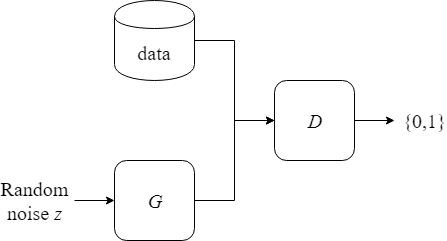

# GAN in TensorFlow

This is a TensorFlow implementation of a simple Generative Adversarial Network (GAN) applied on a simple task. For more information check out my blog article about GANs https://cfml.se/blog/generative_adversarial_networks/.
